# Web App QA Testing Suite

[](https://github.com/dev-tine/Web-App-QA-Testing-Suite/actions/workflows/playwright.yml)
[](https://github.com/dev-tine/Web-App-QA-Testing-Suite/actions/workflows/api-tests.yml)


A manual-first QA portfolio with an automated safety net: an executed test
cycle, reproducible defect records, risk-based scope, traceability, and a
Playwright and Postman CLI suites that run in CI and regenerate their own
execution evidence.

Two applications are under test, both live:

| Application | What it is | Testing approach |
|---|---|---|
| **AVIIHAI HOA Management System** | A homeowners association back office for dues payments and business clearance permits | Executable Playwright cases, CI reports, and generated screenshots |
| **ECL Operations Hub** | An internal operations platform for relationships, pipeline and work items | Executed manual workbook, defect records, and rendered report previews |

### Portfolio snapshot

| Work sample | Evidence a reviewer can verify |
| --- | --- |
| **Professional manual QA scope** | 15 structured workbooks, 5,209 planned scenarios, 615 manually executed cases, 19 QA and UI defects, and 36 smoke-test observations; private artifacts withheld |
| **ECL manual QA cycle** | 26 cases designed, 21 executed, 5 findings recorded, and 1 false positive retracted after investigation and re-test |
| **AVIIHAI test automation** | Functional, regression, responsive, and accessibility checks mapped to requirements and defects, with CI reports, traces, videos, and refreshed screenshots |
| **API testing** | 81 sanitized academic Postman requests plus a separate 13-request, assertion-based regression collection that runs with Postman CLI in CI |

---

## Start here

| If you want to see | Open |
|---|---|
| Verified professional manual QA scope | [`manual-testing/PROFESSIONAL-SCOPE.md`](./manual-testing/PROFESSIONAL-SCOPE.md) |
| How the testing was planned and scoped | [`docs/TEST-PLAN.md`](./docs/TEST-PLAN.md) |
| Every defect found, with reproduction steps | [`docs/DEFECT-LOG.md`](./docs/DEFECT-LOG.md) |
| Which case covers which requirement and defect | [`automation-tests/docs/aviihai-coverage-matrix.md`](./automation-tests/docs/aviihai-coverage-matrix.md) |
| A full manual test cycle | [`ECL case study`](./manual-testing/case-studies/ecl-operations-hub/) |
| The issued manual test workbook | [`ECL-Hub-Test-Report-Cycle1.xlsx`](./manual-testing/case-studies/ecl-operations-hub/ECL-Hub-Test-Report-Cycle1.xlsx) |
| Two detailed manual defect records | [`SELECTED-DEFECT-RECORDS.md`](./manual-testing/case-studies/ecl-operations-hub/SELECTED-DEFECT-RECORDS.md) |
| The automated suite itself | [`automation-tests/tests/`](./automation-tests/tests/) |
| Postman API testing and CI | [`api-testing/`](./api-testing/) |
| AVIIHAI screenshots captured from the live application | [`manual-testing/screenshots/`](./manual-testing/screenshots/) |

---

## Repository map

```
Web-App-QA-Testing-Suite/
│
├── docs/
│   ├── TEST-PLAN.md                     Scope, approach, entry and exit criteria, risks
│   └── DEFECT-LOG.md                    Every defect, with steps and standards references
│
├── automation-tests/
│   ├── playwright.config.js             Two projects: desktop Chromium and Pixel 7
│   ├── docs/
│   │   └── aviihai-coverage-matrix.md   Traceability matrix, case to defect
│   └── tests/
│       ├── pages/                       Page objects
│       ├── helpers/                     Shared authentication helper
│       ├── aviihai-auth.spec.js         Authentication and access control
│       ├── aviihai-dashboard.spec.js    Officer home
│       ├── login.spec.js                Login fields and accessibility
│       ├── navigation.spec.js           Routing and cross route structure
│       ├── payments.spec.js             Payments module
│       ├── clearance.spec.js            Business clearance module
│       ├── settings.spec.js             Settings module
│       ├── evidence.spec.js             Screenshot capture for the documentation
│       └── portfolio-smoke.spec.js      External smoke check
│
├── manual-testing/
│   ├── PROFESSIONAL-SCOPE.md             Private-work scope, method, and disclosure boundary
│   ├── case-studies/
│   │   └── ecl-operations-hub/
│   │       ├── ECL-Hub-Test-Report-Cycle1.xlsx
│   │       ├── SELECTED-DEFECT-RECORDS.md
│   │       └── evidence/                 Rendered workbook previews
│   └── screenshots/                     AVIIHAI evidence, regenerated by CI
│
├── api-testing/
│   ├── postman/                         Runnable collection plus sanitized academic exports
│   ├── mock-api/                        Deterministic synthetic service for reproducible runs
│   ├── docs/                            API test plan, academic scope and traceability
│   └── scripts/                         Postman CLI runner and lifecycle control
│
└── .github/workflows/                   Playwright and Postman CI workflows
```

---

## What this portfolio demonstrates

### 1. An executed manual cycle, not an empty template

The ECL case study contains a completed, downloadable test workbook with 26
designed cases, 21 executions, actual results, status, severity, and linked
defect references. The cycle covers functional behaviour, navigation, UI
consistency, empty states, front-end timing, and WCAG 2.1 AA spot checks.

The five not-run cases are also accounted for. Write operations were excluded
to keep testing non-destructive against live data, while filter and search
cases were documented for a later cycle.

[Review the case study](./manual-testing/case-studies/ecl-operations-hub/) or
[download the issued workbook](./manual-testing/case-studies/ecl-operations-hub/ECL-Hub-Test-Report-Cycle1.xlsx).


### 2. QA judgment, including when not to file a product bug

A rendering issue was raised as Critical during the ECL cycle, then did not
reproduce in a normal foreground session. Investigation showed that the test
session was driving a background browser tab, where timer throttling affected
the render path.

The finding was closed as a test-environment artifact, the affected case was
re-run and passed, and the full reasoning stayed in the report. The record shows
the evidence behind both the initial severity and the decision to retract it.
[Read the selected defect records](./manual-testing/case-studies/ecl-operations-hub/SELECTED-DEFECT-RECORDS.md).

### 3. Automation that protects live data

The AVIIHAI suite runs against a live demo database on every push. No spec
submits a form. Required-field behaviour is verified through the Constraint
Validation API by reading `form.checkValidity()` and each control's
`validity.valueMissing`, which is what the browser checks before submission.

The boundary is explicit: this proves the browser blocks an invalid submit. It
does not prove server-side rejection. A seeded staging environment is named in
the test plan as the requirement for destructive and server-validation checks.

### 4. Automation that reports risk without turning known bugs into noise

Cases asserting the correct behaviour of documented open defects use
`test.fail()`. The build stays green while a known defect remains open, but an
unexpected pass immediately signals that the behaviour changed and the defect
may be ready for re-test and closure.

The suite also performs a preflight before every spec. That check exposed a
Critical routing issue: direct entry or refresh on a sub-route returned the
hosting provider's `404: NOT_FOUND` page, even though in-app navigation worked.
It was recorded as DEF-111 with reproduction steps and the deployment fix.

### 5. API testing with an honest evidence boundary

Ten school Postman collections preserve 81 saved requests across CRUD,
authentication, OTP, filtering, nested resources and multi-step workflows. The
original localhost backends are no longer available, so the exports are
sanitized and labelled as historical manual API evidence instead of being
passed off as a runnable suite.

A separate 13-request regression collection demonstrates current capability:
positive and negative cases, JSON schema and value assertions, bearer-token
handling, dynamic resource chaining, deterministic setup, cleanup verification,
Postman CLI execution and a dedicated CI workflow. [Review the API testing case
study](./api-testing/).

---

## Automated coverage at a glance

| Area | Cases | Notes |
|---|---|---|
| Authentication and access control | 8 | Including deep link resolution and access after sign out |
| Login page, field level and accessibility | 18 | WCAG 2.1 AA spot checks mapped to success criteria |
| Officer home | 5 | |
| Navigation and cross route structure | 10 | Title uniqueness, landmarks, accessible names |
| Payments | 11 | Form, reference data, records, filter, search, empty state |
| Business clearance | 11 | Form, three reference lists, history, empty state |
| Settings | 7 | Officer roster, directors, contacts |
| Evidence capture | 12 | Desktop and mobile viewports |

Twelve defects are open against the AVIIHAI build: one Critical, four Major and
seven Minor. Each one has reproduction steps and, where it applies, the WCAG
success criterion it breaches. See [`docs/DEFECT-LOG.md`](./docs/DEFECT-LOG.md).

---

## Automated evidence: AVIIHAI

Captured by `evidence.spec.js` against the live application and committed back
to the repository by CI on every push to `main`. Nothing here is pasted in by
hand, so nothing here can quietly go stale.

| Login, default state | Login, native validation | Login, rejected credentials |
|---|---|---|
| 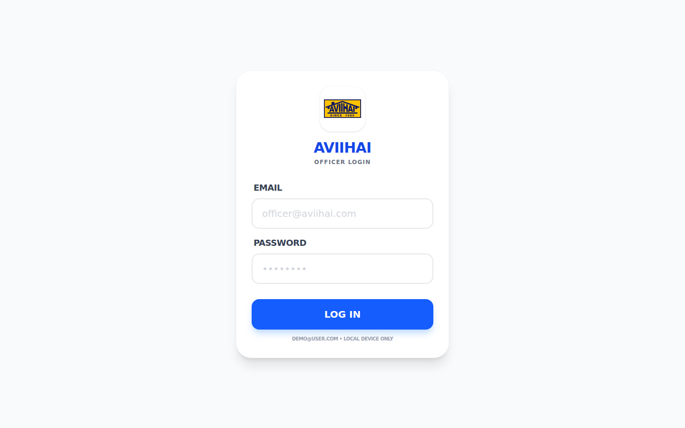 | 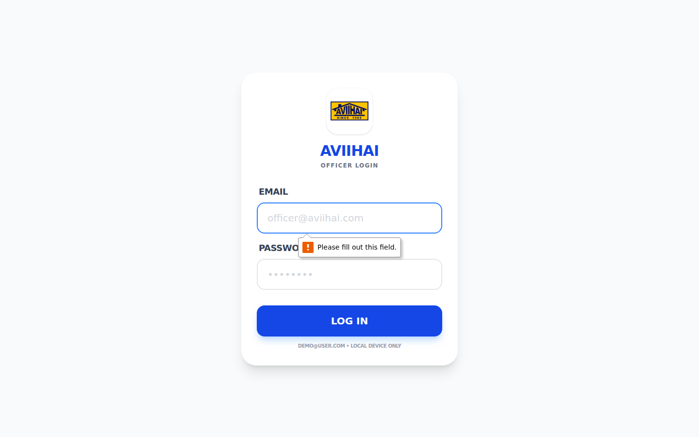 | 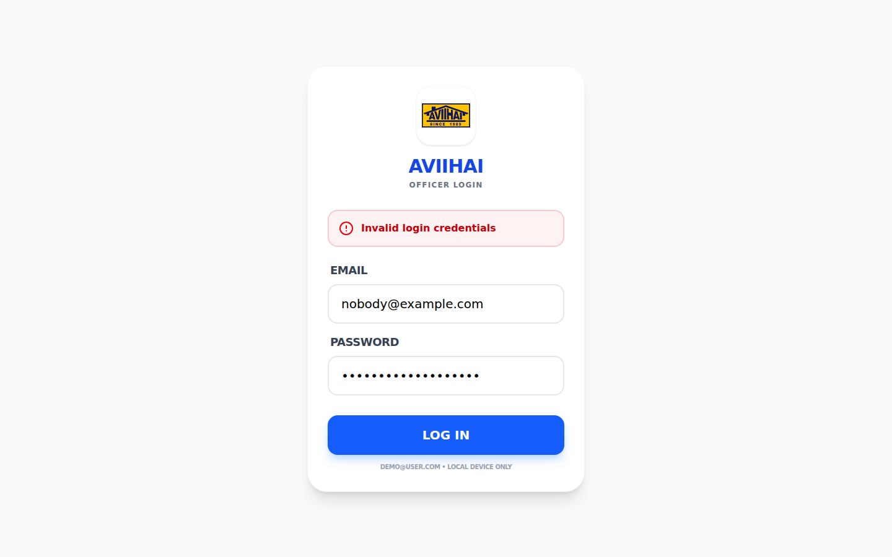 |

| Officer home | New payment form | Payment records |
|---|---|---|
| 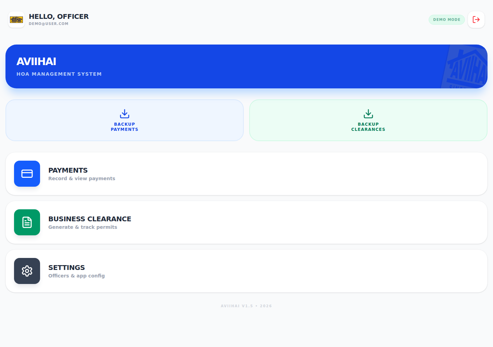 | 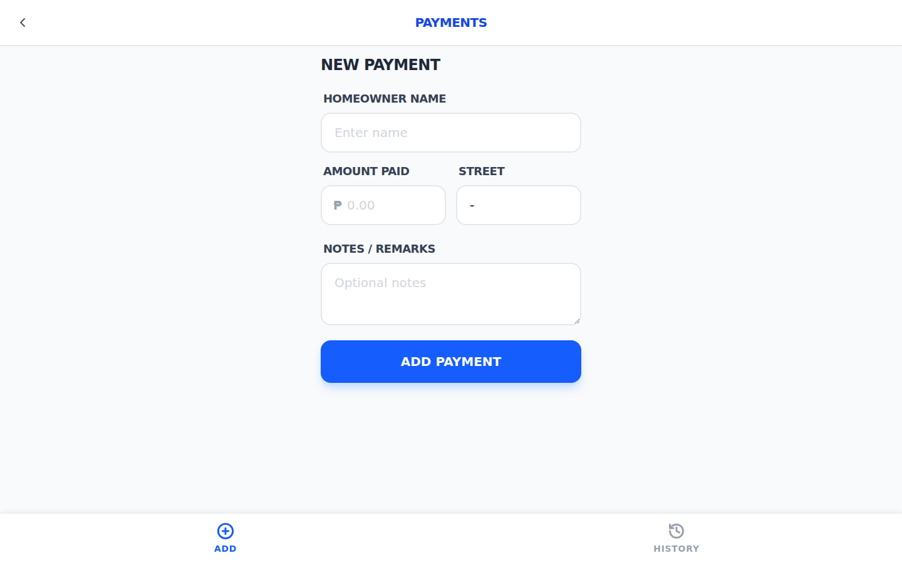 | 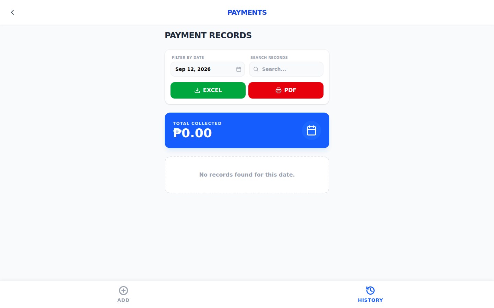 |

| New clearance form | Clearance history | Settings, officer roster |
|---|---|---|
| 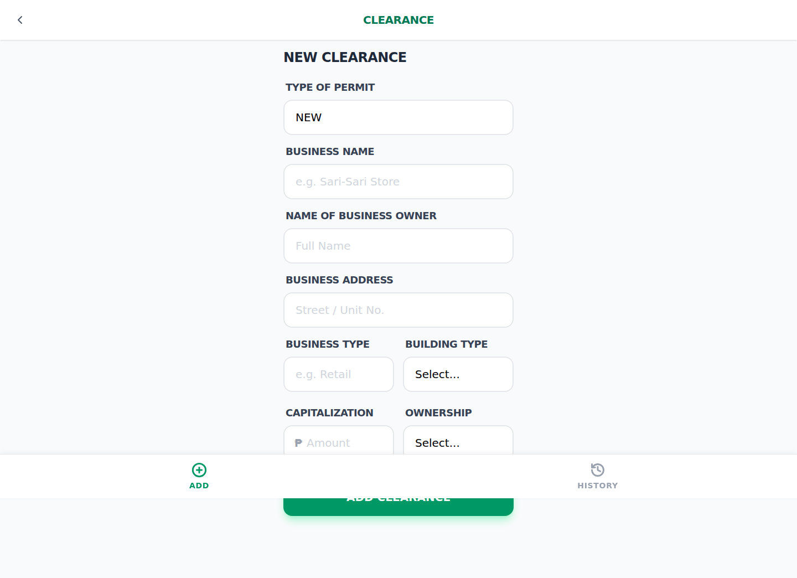 | 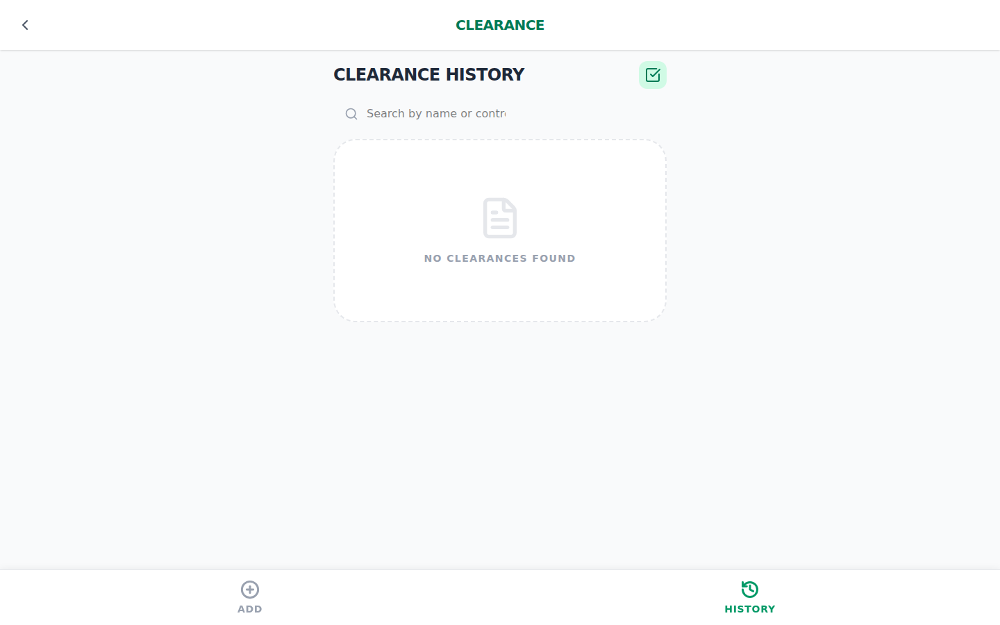 | 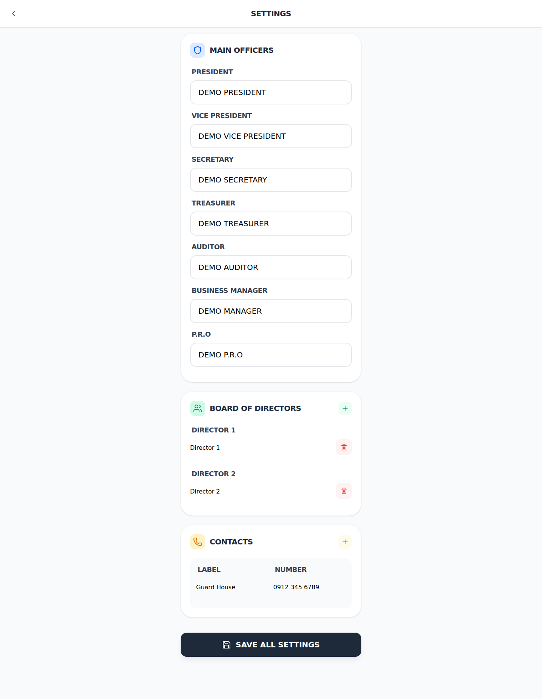 |

Mobile viewport, Pixel 7:

| Login | New payment form |
|---|---|
| 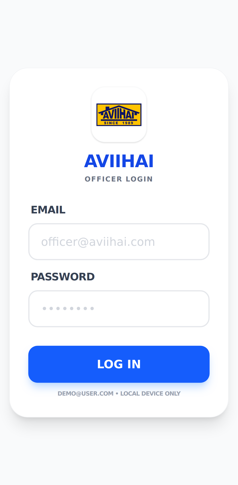 | 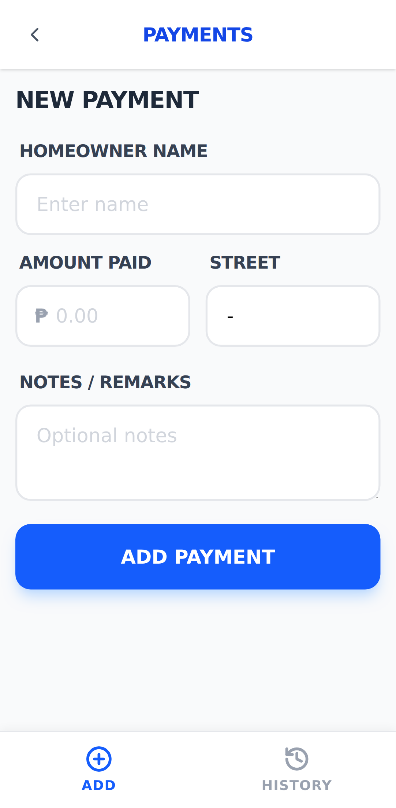 |

The full set, including the naming convention, is in
[`manual-testing/screenshots/`](./manual-testing/screenshots/).

## Running the suite

```bash
cd automation-tests
npm ci
npx playwright install --with-deps chromium
```

Create `automation-tests/.env`:

```
DEMO_EMAIL=your-demo-account@example.com
DEMO_PASSWORD=your-demo-password
```

That file is gitignored, so credentials never end up in the repo. Without them
the authenticated specs just skip.

```bash
npm test               # the full suite
npm run test:smoke     # the external smoke check only
npm run test:headed    # watch it run
npm run test:ui        # Playwright UI mode
npm run report         # open the last HTML report
```

Point the suite at another build with `BASE_URL=https://staging.example.com npm test`.

### In CI

The workflow runs on every push to `main`, on pull requests and on demand. It
needs two repository secrets, `DEMO_EMAIL` and `DEMO_PASSWORD`, under
**Settings → Secrets and variables → Actions**.

Each run publishes the HTML report as an artifact, uploads traces and videos
for any failure, and commits refreshed evidence screenshots back to
`manual-testing/screenshots`.

---

## Techniques used

**Automation.** Playwright Test, page object model, shared fixtures, role based
and accessible name selectors, constraint validation through the DOM, expected
failure annotations, cross-viewport projects, trace and video on failure,
GitHub Actions with artifact publishing and evidence commit back.

**API testing.** Postman CLI, status and schema assertions,
positive and negative paths, bearer-token workflows, collection variables,
request chaining, isolated test data and CI report artifacts.

**Test design.** Test planning, scope and exclusion rationale, entry and exit
criteria, risk register, traceability from case to defect to standard,
severity classification, deferred scope with named blockers.

**Manual QA.** Test case authoring with preconditions and numbered steps,
execution tracking, defect reporting with reproductions and evidence, retest
and closure, WCAG 2.1 AA spot checking, front-end timing read from the
Navigation Timing API rather than a stopwatch.

---

## Background

Manual QA experience from a software QA internship: test case design in
spreadsheets, execution tracking, and defect reporting and retesting in ClickUp.
That work included 15 structured QA workbooks, 5,209 planned scenarios, 615
manually executed cases, 19 QA and UI defects, and 36 smoke-test observations.
The [professional scope note](./manual-testing/PROFESSIONAL-SCOPE.md) documents
the workflow and disclosure boundary. The public case study, defect log, and
traceability matrix are rebuilt against applications I can publish.

---

## Contact

- LinkedIn: https://www.linkedin.com/in/destine-april-fortaliza/
- Portfolio: https://www.devtine.xyz/
- GitHub: https://github.com/dev-tine
