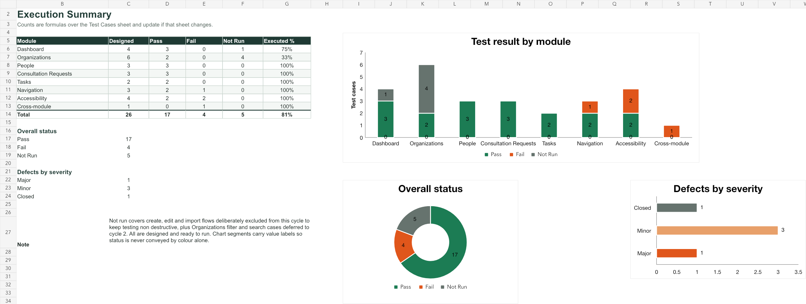

# Manual QA Case Study: ECL Operations Hub

Manual functional and accessibility test pass against a live internal operations platform. Cycle 1, September 2026.

**Primary deliverable:** [Download the complete Excel test report](./ECL-Hub-Test-Report-Cycle1.xlsx)

## Review this project in 60 seconds

1. Open the [execution summary](./evidence/execution-summary.png) for coverage and status.
2. Read the [selected defect records](./SELECTED-DEFECT-RECORDS.md) for complete reproduction and investigation examples.
3. Download the [Excel workbook](./ECL-Hub-Test-Report-Cycle1.xlsx) to inspect all 26 test cases and 5 defect records.

The report demonstrates manual test design, execution, defect reporting,
severity assessment, accessibility evaluation, browser-based performance
checks, retesting, and the decision to retract a false positive.

## What this is

A single-tester test pass covering six modules of a web operations platform: Dashboard, Organizations, People, Consultation Requests, Tasks and global navigation. Functional and UI coverage, plus WCAG 2.1 AA spot checks.

The workbook contains four sheets:

| Sheet | Contents |
| --- | --- |
| Cover | Document control, test basis, scope, method, result summary, severity definitions |
| Summary | Coverage by module with charts, all counts driven by formulas |
| Test Cases | 26 cases with preconditions, numbered steps, expected result, actual result, status |
| Defect Log | 5 defects with full reproduction steps, evidence and standards references |

Browser-friendly previews are also included:

- [Report cover and test basis](./evidence/report-cover.png)
- [Execution summary and charts](./evidence/execution-summary.png)
- [Test cases](./evidence/test-cases.png)
- [Defect log](./evidence/defect-log.png)

## Results

| Metric | Count |
| --- | --- |
| Test cases designed | 26 |
| Executed | 21 |
| Passed | 17 |
| Failed | 4 |
| Not run | 5 |
| Defects raised | 5 |
| Defects open | 4 |
| Closed, not a defect | 1 |

Execution rate 81 percent. The five not-run cases are create, edit and import flows deliberately excluded to keep the pass non destructive against live data, plus filter and search cases deferred to cycle 2.

## Representative executed cases

| Test ID | Coverage | Result | What was verified |
| --- | --- | --- | --- |
| TC-DSH-001 | Functional | Pass | All six dashboard metric cards rendered with counts and captions within five seconds. |
| TC-ORG-006 | Performance observation | Pass | Organization data returned HTTP 200 in 2.31 seconds on the first run and 3.81 seconds on re-test. |
| TC-NAV-003 | Navigation and accessibility | Fail, Major | Four routes used the same document title, affecting tabs, history, bookmarks, and screen-reader navigation. |
| TC-A11Y-001 | Accessibility baseline | Pass | Language, heading count, landmarks, button names, image alt text, and form labels were verified against the live DOM. |
| TC-A11Y-003 | Keyboard accessibility | Fail, Minor | No skip link was available, requiring keyboard users to pass through 12 sidebar destinations on every page load. |
| TC-UI-001 | Cross-module consistency | Fail, Minor | Equivalent empty states used different structures in adjacent list modules. |

## Defects found

**DEF-001, Major.** Every route sets the same browser tab title. Users with several tabs open cannot tell them apart, browser history and bookmarks are indistinguishable, and screen readers announce no page change on navigation. WCAG 2.1 SC 2.4.2 Page Titled, Level A. Verified on four routes.

**DEF-002, Minor.** An `h2` is emitted before the `h1` on every page, so a screen reader user navigating by heading meets a sub heading before learning what page they are on. WCAG 2.1 SC 1.3.1.

**DEF-003, Minor.** No skip link. The sidebar carries 12 destinations, so a keyboard-only user tabs through all of them on every page load. WCAG 2.1 SC 2.4.1 Bypass Blocks, Level A.

**DEF-004, Minor.** Two adjacent list modules render the same empty state two different ways.

**DEF-005, Critical, closed as not a defect.** See below.

## The finding I retracted

On the first pass the Organizations list appeared never to render. Zero rows at 35 seconds, at 102 seconds and at 139 seconds, while the data request had already returned 200 at 2.31 seconds. I raised it as Critical.

It did not reproduce on re-test. Root cause sat in the test environment rather than the product: the session was driving a background browser tab, where `document.visibilityState` reported `hidden` and the browser throttles the timers the render path depends on.

I closed it as not a defect and kept it in the report. A finding that does not reproduce under normal conditions is not a finding, and the reasoning behind closing one belongs in the record.

## Method notes

Cases were executed manually in browser, Chrome 140 on macOS at 1512 x 797. Front-end timings were read from the Navigation Timing and Resource Timing APIs rather than measured by stopwatch. Accessibility checks ran against the live DOM covering landmarks, heading order, accessible names, form labelling and document title, then mapped to WCAG 2.1 success criteria. Chart segments carry value labels so status is never conveyed by colour alone.

## Evidence handling

ECL is an internal operations system, so this public case study uses sanitized
test records and rendered previews of the issued report. In-product screenshots
and private operational data are not published. The workbook preserves the
exact environment, steps, expected results, actual results, status, severity,
and defect references recorded during execution.

## What passed

Worth recording, because a report of only failures is not a report. The application's accessibility baseline is solid: `lang` is set, there is exactly one `h1`, the `main`, `nav` and `header` landmarks are all present, 11 of 11 buttons carry accessible names, images carry alt text, form controls are labelled, and no console errors or warnings were captured across the pass.

**Tester:** Destine April Fortaliza
